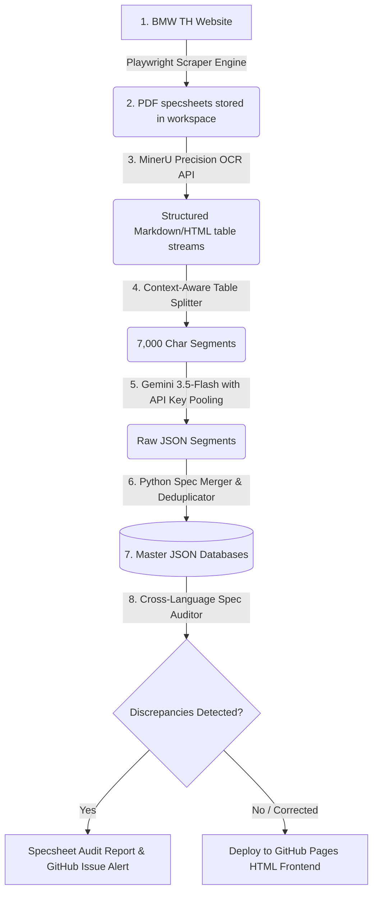

# 🚀 BMW Specsheet Audit & Integration Engine
**เอกสารสรุปสถาปัตยกรรมระบบและมูลค่าทางธุรกิจสำหรับผู้บริหารและฝ่าย IT (Executive & IT Pitch Summary)**

---

## 🎯 1. Executive Summary (สำหรับผู้บริหาร)

### ปัญหาในปัจจุบัน (Current Pain Points)
* **การนำเข้าข้อมูลสเปกรถยนต์แบบเดิม (Manual Process):** เจ้าหน้าที่ต้องอ่านโบรชัวร์ PDF ความยาว 4-5 หน้า และพิมพ์สเปก/ออปชันกว่า 200 รายการลงฐานข้อมูลด้วยมือ ซึ่งใช้เวลาสูงและเสี่ยงต่อการพิมพ์ผิดพลาดอย่างรุนแรง
* **ข้อมูลขัดแย้งข้ามภาษา (TH/EN Discrepancy):** โบรชัวร์ภาษาไทยและภาษาอังกฤษของรุ่นเดียวกันมักมีข้อมูลขัดแย้งกัน (เช่น ขนาดล้อต่างกัน, ออปชันบางอย่างฝั่งหนึ่งระบุมี แต่อีกฝั่งระบุไม่มี) ซึ่งส่งผลต่อความน่าเชื่อถือทางกฎหมาย และทำให้ลูกค้าสับสน
* **การตรวจสอบที่ล่าช้า (Delayed Audit):** ทีมแผนก Product Planning หรือฝ่ายขายไม่มีเครื่องมือตรวจสอบสเปกข้ามภาษาแบบเรียลไทม์ ทำให้พบจุดผิดพลาดเมื่อเผยแพร่สู่สาธารณะไปแล้ว

### โซลูชันที่นำเสนอ (The Solution)
ระบบ **BMW Specsheet Audit & Integration Engine** คือแพลตฟอร์มระบบอัตโนมัติ (Automated Pipeline) ที่ใช้เทคโนโลยี **Document AI (OCR Layout-Aware)** และ **Generative AI (Gemini 3.6-Flash)** ร่วมกับสคริปต์ออดิตอัจฉริยะในการ:
1. **Scrape & Sync:** ตรวจจับและดาวน์โหลดโบรชัวร์ใหม่จากเว็บไซต์ BMW Thailand โดยอัตโนมัติทุกวัน
2. **AI Extraction:** สกัดข้อมูลสเปกจาก PDF แปลงเป็นโครงสร้างฐานข้อมูล JSON ที่แม่นยำสูงภายในไม่กี่วินาที
3. **Automated Audit:** เปรียบเทียบข้อมูลภาษาไทยและอังกฤษ เพื่อชี้เป้าจุดขัดแย้งทางสเปกและตัวเลข (เช่น ล้อหลังพิมพ์ผิดเป็น 1.05 นิ้ว หรือซีรีส์ยางต่างกัน) และแจ้งเตือนทันที
4. **Dynamic Frontend:** แสดงผลข้อมูลที่ถูกต้องและเปรียบเทียบสเปกผ่านหน้าเว็บ HTML ที่ใช้งานง่ายและอัปเดตแบบเรียลไทม์

---

## 💡 2. Business Value Proposition (มูลค่าทางธุรกิจ)

> [!IMPORTANT]
> **ระบบนี้ช่วยลดต้นทุนและป้องกันความเสี่ยงขององค์กรได้อย่างมีนัยสำคัญ**

* **ลดเวลาการตรวจสอบลง 99%:** จากเดิมที่ฝ่าย Product Planning ต้องใช้เวลาหลายวันในการเปรียบเทียบและตรวจทานข้อมูลสเปกข้ามภาษาก่อนออกแคมเปญ ระบบสามารถสแกนและเปรียบเทียบเสร็จสิ้นในเวลา **ไม่เกิน 2 นาที**
* **ลดความเสี่ยงทางกฎหมายและภาพลักษณ์ (Risk Mitigation):** ป้องกันการโฆษณาข้อมูลสเปกผิดพลาดสู่สาธารณะ ซึ่งอาจนำไปสู่ข้อพิพาททางกฎหมายกับลูกค้า หรือการถูกปรับจากหน่วยงานคุ้มครองผู้บริโภค
* **ระบบอัปเดตตัวเองอัตโนมัติ (Zero-Maintenance):** ทำงานแบบคลาวด์อัตโนมัติ (Daily Automation Run) เจ้าหน้าที่ฝ่าย IT ไม่ต้องเสียเวลาดูแลระบบในแต่ละวัน
* **ช่วยเพิ่มยอดขาย (Sales Enablement):** ฝ่ายขาย (Product Specialists / Dealers) มีฐานข้อมูลสเปกที่ถูกต้อง แม่นยำ และค้นหาได้อย่างรวดเร็วผ่านมือถือหรือแท็บเล็ต ช่วยเพิ่มความมั่นใจในการปิดการขาย

---

## ⚙️ 3. System Workflow & Architecture (สถาปัตยกรรมระบบสำหรับฝ่าย IT)

กระบวนการทำงานของระบบแบ่งออกเป็น 6 ขั้นตอนหลักแบบครบวงจร (End-to-End Pipeline) ดังนี้:

### รายละเอียดการทำงานของแต่ละส่วน (Technical Breakdown)

#### 1. Automated Scraper Engine (`pdf_scraper.py`)
* ใช้เทคโนโลยี **Playwright (Headless Browser)** ในการเข้าหน้าเว็บโบรชัวร์ของ BMW Thailand กวาดข้อมูล (Scrape) หาลิงก์ PDF ทั้งหมด
* ทำการซิงค์ข้อมูลดาวน์โหลดเฉพาะไฟล์ที่เพิ่มใหม่ ข้ามไฟล์ซ้ำ และตรวจจับไฟล์ของรุ่นที่ยกเลิกการขาย (Discontinued) เพื่อทำการลบออกโดยอัตโนมัติ

#### 2. Layout-Aware OCR Engine (`MinerU API`)
* PDF โบรชัวร์รถยนต์มีรูปแบบที่ยากต่อการดึงข้อความทั่วไป เพราะข้อมูลอยู่ในรูปแบบตารางซับซ้อนและมีสัญลักษณ์เวกเตอร์เช็กบ็อกซ์ (เช่น ■ หมายถึง ติดตั้งเป็นมาตรฐาน / - หมายถึง ไม่มีออปชัน)
* ระบบใช้ **MinerU Precision API** ซึ่งเป็นโมเดลวิเคราะห์ Layout ของเอกสารเชิงลึก (Deep Document Layout Analysis) ในการแปลงตาราง PDF ออกมาเป็นเอกสาร Markdown และ HTML Table แบบคงโครงสร้างเดิมไว้ 100% ทำให้สัญลักษณ์ติ๊กถูก-ผิดไม่คลาดเคลื่อน

#### 3. Context-Aware Table Splitter & Size Limit Logic
* ข้อความที่ได้จากโบรชัวร์อาจมีความยาวถึง 25,000 ตัวอักษร ซึ่งอาจทำให้โมเดลภาษาหลุดโฟกัส
* สคริปต์จะทำการแบ่งก้อนเนื้อหาออกเป็นส่วนย่อยก้อนละ **7,000 ตัวอักษร** โดยมีอัลกอริทึมตรวจสอบไม่ให้ตัดแบ่งระหว่างแถวของตาราง (`is_mid_table` check) เพื่อให้โครงสร้างตาราง HTML สมบูรณ์ที่สุดเมื่อส่งเข้าประมวลผลต่อ

#### 4. AI-Powered Extractor & Key Pooling (`mineru_extractor.py`)
* ส่งเนื้อหาแต่ละก้อนเข้าสู่ **Gemini 3.6-Flash API** ร่วมกับคำสั่งควบคุมที่รัดกุม (Strict System Prompt) เพื่อดึงข้อมูลสเปกออกมาในโครงสร้าง JSON
* **ระบบการสกัดหมวดหมู่แบบแยกเงื่อนไข (Conditional Categories):** แยกการสกัดเป็นหมวดหมู่มาตรฐานทั่วไป (Standard) และหมวดหมู่ระบุเงื่อนไขตามข้อมูลจริง (Conditional) เช่น ตารางการชาร์จไฟ AC/DC และสีรถภายนอก เพื่อไม่ให้เกิดคีย์ขยะหรือตารางว่างเปล่าใน JSON
* **ระบบความทนทานต่อข้อผิดพลาด (Fault Tolerance):** 
  * มีการทำ **API Key Pooling & Rotation** หมุนเวียนคีย์ API 3 คีย์สลับกันเพื่อหลีกเลี่ยงโควต้าเต็ม (Rate Limits)
  * มี **Fallback Models** หากโมเดลหลักติดปัญหา ระบบจะดาวน์เกรดไปเรียก **`gemini-3.5-flash`** หรือ **`gemini-3.5-flash-lite`** เพื่อประมวลผลต่อโดยอัตโนมัติ (และเอาพารามิเตอร์ตกรุ่นอย่าง `temperature` ออกทั้งหมดเพื่อเลี่ยง HTTP 400)

#### 5. Spec Merger & Deduplicator (`spec_merger.py` / Python Engine)
* รวบรวมข้อมูล JSON ย่อยจากแต่ละเซกเมนต์กลับมาผสานกัน ตรวจสอบค่าซ้ำซ้อน จัดระเบียบรุ่นรถยนต์ และบันทึกเป็นฐานข้อมูลหลัก `bmw_master_specs.json` และ `bmw_master_specs_en.json`

#### 6. Cross-Language Spec Auditor (`compare_th_en_db.py`)
* ทำหน้าที่เป็นผู้ตรวจสอบคุณภาพ (QA Auditor) เปรียบเทียบไฟล์สเปกภาษาไทยและอังกฤษทีละรุ่นรถยนต์
* **ประเภทประเด็นที่ระบบออดิตจับตา:**
  * **Option Presence Mismatch:** ระบบหนึ่งติ๊กมีออปชัน (■) แต่อีกระบบระบุไม่มี (-)
  * **Numerical Mismatch:** ตัวเลขทางเทคนิคต่างกัน เช่น แรงบิดคนละรอบเครื่อง หรือซีรีส์ขนาดยางล้อไม่เท่ากัน
  * **Option Overlap Abnormalities:** ข้อผิดพลาดในตาราง เช่น ระบุว่ารถรุ่นเดียวกันมีทั้ง "ช่วงล่าง M Sport" และ "ช่วงล่าง Adaptive M" ซึ่งในทางวิศวกรรมจริงต้องเลือกเพียงระบบเดียว
* สร้างรายงานข้อผิดพลาดเป็นมาร์กดาวน์ไฟล์ `specsheet_audit_report.md` เพื่อส่งต่อทีม Product Planning

---

## 🔒 4. IT Architecture & Security Standards (ความปลอดภัยและมาตรฐานไอที)

* **ความปลอดภัยของข้อมูลหลัก (Data Privacy):** ข้อมูลทั้งหมดเป็นข้อมูลรายละเอียดรถยนต์ที่เป็นสาธารณะ ไม่มีการประมวลผลข้อมูลส่วนบุคคล (PDPA) หรือข้อมูลความลับองค์กร
* **การปกป้อง API Keys:** คีย์การใช้งาน Gemini API และสิทธิ์ระบบอื่นๆ จะถูกโหลดผ่านไฟล์สภาพแวดล้อม `.env` บนเครื่องโลคอล หรือจัดเก็บในระบบ **GitHub Encrypted Secrets** บนคลาวด์ ไม่มีการเขียนฮาร์ดโค้ดลงไปในสคริปต์เด็ดขาด
* **มาตรฐานโครงสร้างข้อมูล:** บันทึกข้อมูลในรูปแบบมาตรฐาน **JSON (Unicode UTF-8)** ทำให้ระบบงานสเปกชีทนี้สามารถเชื่อมต่อผ่าน API ส่งข้อมูลต่อไปยังระบบแอปพลิเคชันหลักของบริษัท ระบบหลังบ้านของศูนย์บริการ (ERP) หรือระบบจัดการข้อมูลลูกค้า (CRM) ได้อย่างทันทีในอนาคต

---

## 📊 5. สรุปความสำเร็จของระบบ ณ ปัจจุบัน (Current Status & Milestones)

* **ความครอบคลุมในการสแกน:** ระบบสแกนและจัดเก็บข้อมูลรถยนต์ BMW ครบถ้วนทุกรุ่นที่ขายในประเทศไทยรวม **33 รุ่นหลัก (โบรชัวร์ภาษาไทย 33 เล่ม และอังกฤษ 33 เล่ม)**
* **ผลการรันจริงล่าสุด:** 
  * ระบบตรวจพบและแก้ไขข้อขัดแย้งเชิงตำแหน่งดัชนี (Category Index Shift) ของรุ่น Z4, iX2 และ M4 Competition เรียบร้อยแล้ว 100% ทำให้ฐานข้อมูลทั้งสองฝั่งมีจำนวนหมวดหมู่ตรงกันสมบูรณ์และเรียงลำดับถูกต้องตามโบรชัวร์จริง
  * ระบบตรวจพบและแก้ไขข้อขัดแย้งของรุ่นอื่นๆ เช่น ปัญหาขนาดยาง M2, M3 CS, M5 Touring, i5 และ M760e สำเร็จลุล่วงแล้ว
* **หน้าเว็บอัปเดตสดชื่น:** หน้าเว็บเปรียบเทียบสเปกชีทเวอร์ชันใช้งานจริง (Production Frontend) สามารถซิงค์อัปเดตสเปกใหม่ล่าสุดทุกครั้งที่มีการเปลี่ยนแบรนช์บนคลาวด์โดยใช้เวลา Deploy ไม่เกิน 2 นาที (ทำงานผ่าน GitHub Actions และ GitHub Pages)
