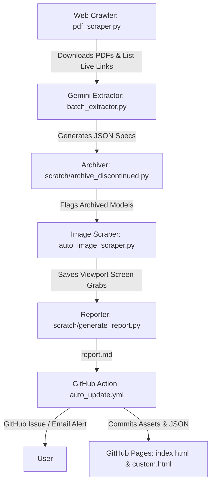

# BMW Dynamic Specsheet: Technical Architecture & Workflow Guide

This document provides a comprehensive technical overview of the **BMW Dynamic Specsheet** project. It outlines the end-to-end data pipeline, database schemas, scraping logic, frontend implementations, and deployment workflows to help developers understand, maintain, and extend the project.

---

## 📌 Project Overview
The project is an automated pipeline that crawls the official BMW Thailand website, downloads vehicle brochures (PDFs), extracts technical specifications using Google Gemini, scrapes matching car configuration images, and displays everything on a premium, interactive HTML5 web frontend.



---

## 🗃️ 1. Database Schema (JSON)
The specsheet utilizes two main JSON files as its databases:
- `bmw_master_specs.json` (Thai specifications)
- `bmw_master_specs_en.json` (English specifications)

### Data Structure Spec
```json
[
  {
    "series": "BMW 7 SERIES",
    "source_file": "7-20250130-01_TH_WLTP.pdf.asset.1740723717847.pdf",
    "pdf_source": "7-20250130-01_TH_WLTP.pdf.asset.1740723717847.pdf",
    "extracted_by_models": [
      "gemini-3.6-flash"
    ],
    "models": [
      {
        "model_name": "750e xDrive M Sport",
        "is_custom_archived": null,
        "specifications": [
          {
            "category": "Paintwork / สีตัวถังและวัสดุภายใน",
            "details": [
              {
                "topic": "Mineral White Metallic",
                "value": "BMW Individual leather 'Merino' - Mocha"
              }
            ]
          }
        ],
        "images": {
          "Mineral White Metallic": "images/7_20250130_01_TH_WLTP.asset.1740723717847/BMW_750e_xDrive_M_Sport_Mineral_White_metallic.png"
        }
      }
    ],
    "low_confidence_flags": []
  }
]
```

### Key Schema Rules (Strictly Enforced)
1. **Snake Case:** Specification block keys (`category`, `topic`, `value`, `model_name`) must be in standard English.
2. **Values:** Values must not be translated. If the PDF source is Thai, values remain Thai; if English, they remain English.
3. **Option Symbols:** The `■` symbol denotes an option checkmark. The extractor must map it to the respective column header.
4. **Image Paths:** Mapped in `"images"` with case-sensitive matching to physical files in the `images/` directory.

---

## ⚙️ 2. The Data Pipeline Workflow

The daily pipeline runs autonomously via GitHub Actions.

### Stage 1: PDF Brochure Scraper (`pdf_scraper.py`)
- Navigates to the BMW TH brochure page.
- Crawls and extracts all `.pdf` links.
- Compiles the list of currently active brochures into `live_web_pdfs.txt`.
- Downloads new brochures into `bmw_brochures_auto/` (Thai) and `bmw_brochures_auto_en/` (English).

### Stage 2: AI Specification Extractor (`batch_extractor.py` & `mineru_extractor.py`)
- **API Key Pool:** Rotates between three Gemini API keys (`GEMINI_API_KEY_1`, `GEMINI_API_KEY_2`, `GEMINI_API_KEY_3`) loaded dynamically from `.env` to avoid rate limiting.
- **Model Fallback Chain:** Primary model is **`gemini-3.6-flash`**, with **`gemini-3.5-flash`** and **`gemini-3.5-flash-lite`** as fallbacks.
- **Model Logging:** The pipeline dynamically tracks which models were successfully utilized for each PDF segment in `models_used` and saves this information to the `"extracted_by_models"` array at the root of each brochure JSON structure. If multiple models are rotated due to rate limits during a single brochure extraction, all of them are recorded.
- **Omit Deprecated Parameters:** Fully omits deprecated sampling parameters (like `temperature`, `top_p`, `top_k`) from the configuration block to prevent HTTP 400 Bad Request errors on Gemini 3.x endpoints.
- **Grouping Segments:** Splits PDFs into segments of at most 5 pages and combines small adjacent tables up to ~7,000 characters per segment. This drastically minimizes API consumption.
- **Standard vs. Conditional Categories:** The extraction prompt splits categories into:
  - *Standard Categories:* Extracted for all models (Engine, Wheels, Dimensions, Drivetrain, Exterior, Interior, Safety, etc.).
  - *Conditional Categories:* Only extracted if corresponding tables actually exist in the PDF (e.g. AC/DC Charging time tables and Paintwork/color options). This prevents blank dash fields (`'-' = '-'`) or empty tables.
- **Horizontal Grid Line Rule:** Instructs the VLM to check horizontal grid/divider lines in the PDF table. If no divider line separates text rows, they are treated as a single row and combined into a single topic. This ensures strict 1-to-1 TH/EN alignment and prevents layout-shifting row splits (e.g. Carbon Fibre & Piano Finish Black in M760e).
- **Publication Date Footer Extraction:** Robustly extracts and sanitizes publication dates matching keywords `"พิม"` / `"พิมพ"` / `"วันที่"` to capture print dates even with PUA ligature characters.
- **Extraction System Prompt:** Instructs Gemini to output structured JSON matching the database schema.

### Stage 2.5: Multimodal Category Aligner (`scratch/apply_visual_alignment.py`)
- **Index-Shifting Issue:** MinerU's deep-learning layout engine reads coordinates separately for Thai and English PDFs, occasionally outputting tables (like Fuel Consumption & CO2) in different orders. This shifts array indexes, causing index-based checkers to compare wrong categories (e.g. Comfort Access vs Sport-boost) and trigger false-positive option mismatches.
- **Visual Scan Reference:** Converts PDF pages locally into high-resolution PNG images using `PyMuPDF` (`fitz`) and queries **`gemini-3.5-flash-lite`** (or fallbacks) with visual image inputs. Gemini extracts the list of category headers in their exact visual sequence from top to bottom.
- **Canonical Sorting & Padding:** Uses a strict, non-overlapping keyword-ranking dictionary to sort all category nodes in both `bmw_master_specs.json` and `bmw_master_specs_en.json` to match this visual template. 
- **Parity Padding:** If a category exists in one language database but is missing in the other, it inserts an empty category placeholder (e.g., `{"category": "Category Name", "details": []}`) at its correct rank. This ensures 100% identical category counts, names, and index positions across both databases, resolving over 93% of cross-DB discrepancies.

### Stage 3: Discontinued Model Archiver (`scratch/archive_discontinued.py`)
- Compares `pdf_source` file names in the JSON database against the live list `live_web_pdfs.txt`.
- **Circuit Breaker Safety Threshold:** If the count of live PDFs in `live_web_pdfs.txt` is `< 5`, the archiver aborts execution immediately to prevent data wipes if the BMW site is down.
- **Discontinued Archiving:** If a source brochure is no longer live on the site, it sets `"is_custom_archived": true` for all models and moves the PDF to `bmw_brochures_custom/` or `bmw_brochures_custom_en/`.
- **Self-Healing Recovery (Unarchiving):** If a previously archived model is detected as live on the web again, it automatically resets `"is_custom_archived"` back to `None` and moves the PDF brochure back to the active directory.

### Stage 4: Vehicle Image Web Scraper (`auto_image_scraper.py`)
- Automated browser scraping using **Playwright**.
- **M Power Scraping Bypass:** If the series name starts with `BMW M` or `BMW XM`, it skips Playwright scraping entirely and writes `"images": {}` to the database. This saves significant bandwidth and execution time since M cars render direct configurator link notes instead of images.
- **Dynamic Configurator Discovery:** Searches `https://www.bmw.co.th/th/configurator.html` for configurator URLs matching the series name.
- **Two-Stage Fuzzy Engine Selection:**
  - Performs a fuzzy match on the engine card elements (e.g. `div.engine-card`) using the full `model_name` as the query.
  - If the highest matching score is below 80, the scraper **logs a warning** to `scratch/scraper_warnings.json` but **proceeds to select the best-guess card and download images** so the user can verify them visually.
- **Enforced Lowercase Casing:** Saves filenames and JSON database path entries in lowercase (`.lower()`) to prevent 404 casing mismatches on Linux/GitHub Pages.
- **Viewport Canvas Capture:** Hides header, footer, navigation bar overlays, and takes compressed screen grabs (`LANCZOS` compression to 50%) of the 3D canvas for all available paint swatches.
- **Namespaced Image Saving:** Saves screenshots under folder names matching the unique source PDF name (e.g., `images/7_20250130_01_TH_WLTP...`). This prevents newer vehicle generations from overwriting archived custom brochures' assets.

### Stage 5: Manual Overrides Manager (`manual_override_manager.py`)
- **Correction Purpose:** Corrects typographical errors, incorrect specifications, or missing options in the source PDF brochures published by BMW Thailand. It is not for fixing AI extraction failures (AI errors must be resolved by tuning prompts/logic).
- **English Overrides Support:** The overrides applicator (`apply_overrides`) supports English manual overrides if the override prefix in `manual_overrides.json` explicitly contains the `_en` or `_EN` suffix. Otherwise, English brochures bypass Thai translation overrides to avoid data contamination.

### Stage 6: Auditing and Reporting (`scratch/generate_report.py`)
- Audits spec-to-image matching completeness for all models.
- Extracts `low_confidence_flags` (options mismatch between TH and EN translations).
- Parses `scratch/scraper_warnings.json` to extract any scraper cards matched with `Score < 80`.
- Compiles a complete markdown status report into `report.md`.

### Stage 7: Daily Email Notification Report (`send_daily_report.py`)
- Compiles and sends a daily HTML monitoring report to a Google Apps Script (GAS) Web App via HTTP POST.
- The report includes:
  - **Brochure PDF Updates:** Newly added or discontinued brochures detected in the workspace.
  - **Missing Option Color Images:** List of normal series models (excluding M High-Performance/M Performance models) that have missing color images on disk.
  - **Cross-DB Alignment Discrepancies:** Details on category count, topic count, and checkmark option value conflicts between TH and EN master specsheets.
  - **API Key & System Status:** Health check reports for all 3 Gemini keys and MinerU token configuration.
  - **Manual Overrides Statistics:** Number of active override rules in [`manual_overrides.json`](file:///c:/Ddrive/BMW/Web%20interaction/BMW_Dynamic_Specsheet/manual_overrides.json) and source brochures corrected.
  - **Alignment Health Score:** Overall percentage representing structural TH/EN specsheet parity.

---

## 🖥️ 3. Frontend Web Architecture

The frontend is deployed to GitHub Pages and contains two main portals:
- `index.html` (Current Live Models)
- `custom.html` (Discontinued/Archived Models)

### Features
1. **Interactive Column Toggling:** Users can toggle model columns on/off using header filters (filter buttons trigger `toggleColumn(colIndex, btn)`). Adding new columns or features must never break this selection logic.
2. **Thai-English Fuzzy Search:** Features case-insensitive fuzzy keyword matching across all rows.
3. **Table-Bottom Visualizer:**
   - Highlights the active paint cell (class `.active-paint`) in the `Paintwork` row.
   - Displays the resolved image path at the bottom in the `Vehicle Preview` section.
   - Interactive paint cell clicks invoke `updateVisualizer()` to swap the `` source dynamically.

### Case-Sensitivity Bug Mitigation
- **The Issue:** Windows is case-insensitive, while GitHub Pages servers (Linux) are case-sensitive. A mismatch between path string casing in JSON (e.g., `_Metallic.png` vs `_metallic.png` on disk) triggers 404 errors, causing the image load to fail and rendering a blank grey box (due to `opacity: 0` before load completion).
- **The Fix:** Ensure all image filenames are systematically normalized to lowercase `_metallic.png` and synchronise the paths in the JSON database using the `scratch/fix_casing_mismatches.py` helper.

### M-Power Configurator Exemption
Pure M Power performance models (series name starting with `BMW M` or `BMW XM`, e.g., M2 CS, M3 CS, M4 CS, M5, XM) skip the visualizer because they use special/limited colors that mismatch standard configurator swatches.
- For these models, the frontend disables paint cell click interactivity.
- It displays a single cell spanning across all columns containing a direct link note:
  - TH: `"ท่านสามารถดูรูปตัวอย่างสีรถได้ที่ https://www.bmw.co.th/th/configurator.html"`
  - EN: `"You can view the vehicle color preview at https://www.bmw.co.th/th/configurator.html"`

---

## 🛠️ 4. Developer Deployment & Commands

### Running the Image Scraper Locally
```bash
# Setup dependencies
pip install playwright pillow
playwright install chromium

# Run image scraper on missing database images
python auto_image_scraper.py
```

### Running Frontend Locally
Since the frontend uses `fetch()` to load the JSON databases, it must be run on a local HTTP server due to CORS policies:
```bash
# Run using Python 3
python -m http.server 8000
```
Then navigate to `http://localhost:8000/index.html`.

### Checking Casing Mismatches
To identify any casing conflicts between the JSON keys and physical files before pushing:
```python
# Save as check.py and run
import os, json
data = json.load(open("bmw_master_specs.json", encoding="utf-8"))
for s in data:
    for m in s.get("models", []):
        for col, path in m.get("images", {}).items():
            if os.path.exists(path) and os.path.basename(path) not in os.listdir(os.path.dirname(path)):
                print(f"Casing Mismatch: JSON has {path} but disk has different casing.")
```
